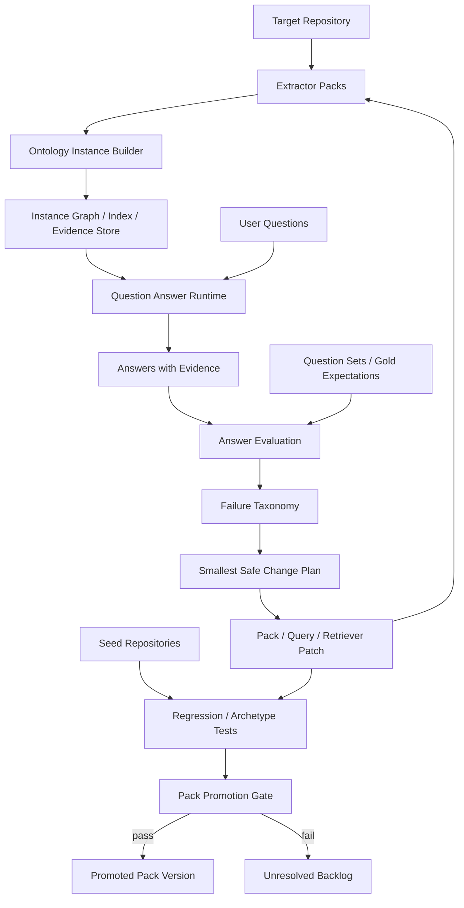

# ontlab 아키텍처 재정렬

## 핵심 목표

ontlab의 목적은 seed repo를 누적 저장하는 것이 아니다.  
목표는 **임의의 코드베이스를 ontology-backed QA system으로 변환하는 것** 이다.

즉:

- 입력: target repository
- 출력:
  - ontology instance
  - 질문 가능한 구조/흐름/의존/인터페이스 모델
  - 근거 기반 답변
  - 실패 답변으로부터의 개선 backlog

---

## 전체 구조도

---

## 1. Core ontology는 작고 안정적이어야 한다

### 엔티티
- Repository
- File
- Module
- Symbol
- Callable
- Endpoint
- Route
- ExternalInterface
- ConfigArtifact
- InfraDependency
- DataStore
- BuildArtifact

### 관계
- contains
- defines
- imports
- calls
- exposes
- handles
- dependsOn
- configuredBy
- consumes
- produces
- persistsTo
- deploysTo
- protects

### 원칙
- core는 쉽게 늘리지 않는다.
- 프레임워크 특이성은 core에 직접 박지 않는다.
- framework / infra / language 지식은 pack으로 격리한다.

---

## 2. 커지는 것은 ontology가 아니라 “생성 능력”이다

### 커지는 대상
- 언어 pack
- 프레임워크 pack
- infra pack
- retrieval 전략
- evidence selection
- question taxonomy
- evaluation rubric
- abstention 정책

### 커지면 안 되는 대상
- seed repo facts
- target repo instance facts
- core ontology 자체

---

## 3. target repo마다 새 ontology instance를 생성한다

`instances/<repo_slug>/` 아래에 아래 산출물을 둔다.

- `graph/` — instance graph
- `evidence/` — file span, symbol path, config key, route mapping
- `questions/` — 질문셋
- `answers/` — 생성 답변
- `eval/` — 평가 결과
- `reports/` — cycle report

즉, seed repo는 generator를 검증하는 데 쓰이고,
실제 답변은 **항상 target repo instance** 로만 한다.

---

## 4. 자기강화 루프는 “답변 실패”에서 출발한다

### 실패 종류
- evidence 부족
- flow 연결 부족
- frontend-backend bridge 실패
- 외부 인터페이스 추론 실패
- infra/config 연결 실패
- security/ownership 경계 실패
- 과잉 추론
- 모르면 모르겠다고 하지 못함

### 개선 단위
항상 다음 중 하나만 바꾼다.

- pack rule 1개
- retrieval rule 1개
- answer rubric 1개
- question taxonomy 1개
- ignore/suppression rule 1개

---

## 5. Codex의 역할

Codex는 “거대한 진실 생성기”가 아니라:

- 탐험가
- 실패 분류자
- 작은 패치 작성자
- 실행자
- 회귀 검증자
- 문서화 담당자

로 동작해야 한다.

핵심은 **작은 개선을 반복하는 것** 이다.

---

## 6. 권장 사이클

1. target repo instance 생성
2. 질문셋 실행
3. 답변 품질 평가
4. 실패 분류
5. 가장 작은 안전한 변경 1개 선택
6. pack/검색/근거선택 수정
7. seed repo 회귀 검증
8. target repo 재평가
9. pass 시 승격, fail 시 backlog 이동

---

## 7. 성공 판정

ontlab이 성공했다는 뜻은:

- 더 많은 repo를 저장하게 된 것이 아니라,
- **새로운 target repo에 대해**
  - 더 빠르게
  - 더 정확하게
  - 더 근거 있게
  - 더 안전하게
  답변할 수 있게 됐다는 뜻이다.

---

## 8. Cycle state는 파일로 외부화한다

긴 작업과 병렬 실험은 채팅만으로 유지하지 않는다.

각 cycle은 `cycle_runs/<cycle-id>/` 아래에 아래를 남긴다.

- `cycle.json` — 현재 상태, score, worktree, branch, conflict key
- `input/` — 선택한 gap, target, prompt
- `trace/` — 단계 전환, 실행 흔적
- `artifacts/` — before/after eval, seed regression, patch diff
- `outputs/` — decision, report, next cycle brief

이 구조 덕분에 Codex는:

- 중간에 pause 되어도 resume 가능하고
- 병렬 cycle 결과를 fan-in 할 수 있고
- promote / defer / rollback 근거를 파일로 남길 수 있다

---

## 9. 병렬 orchestration은 fan-out / fan-in / single-promoter 로 한다

### Fan-out
- non-conflicting gap만 같은 batch에 넣는다
- 각 cycle은 별도 worktree / branch / cycle dir / instance tmp dir 를 가진다
- seed corpus는 read-only cache로 취급한다
- read-only 탐험가와 비평가는 병렬로 돌릴 수 있다

### Fan-in
- 각 cycle은 결과만 중앙으로 모은다
- 최소 취합물:
  - changed files
  - target before / after score
  - seed regression result
  - conflict keys
  - promotion proposal

### Single-promoter
- 승격 결정은 한 주체만 한다
- fan-in 뒤 통합 eval을 다시 돌린다
- 기준 미달이면 promote 하지 않고 defer 또는 rollback 한다

즉, 병렬화 대상은 탐험과 실험이고, 승격은 중앙집중화한다.

---

## 10. 자율 반복은 종료 조건이 있을 때만 허용한다

“완성도가 높아질 때까지”는 허용되지만, stop/pause 규칙이 없으면 안 된다.

- target weighted score가 목표 이상이면 pause
- evidence coverage / abstention quality가 목표 이상이면 pause
- seed regression pass rate가 하락하면 pause 또는 rollback
- 최근 5 cycle improvement가 threshold 미만이면 pause
- 동일 failure taxonomy가 3회 연속 개선되지 않으면 human review queue로 이동
